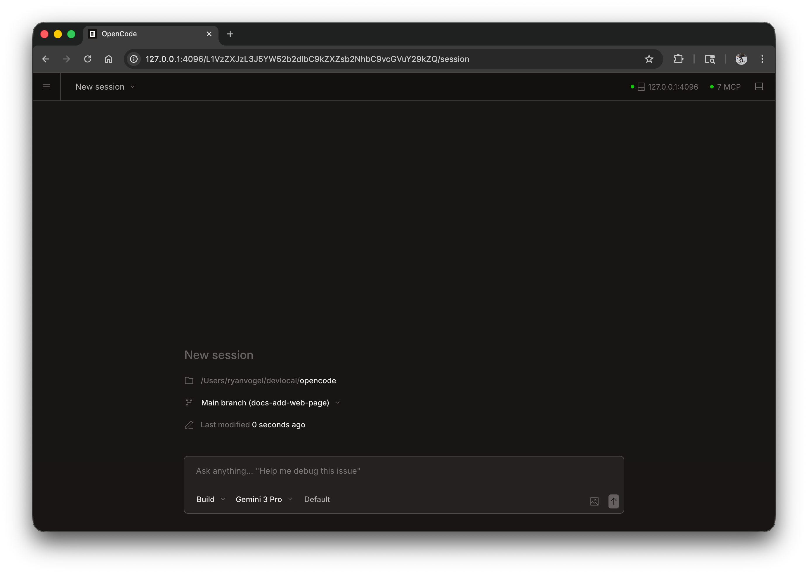

Loongcode kan kjøres som en nettapplikasjon i nettleseren din, og gir den samme kraftige AI-kodingsopplevelsen uten at du trenger en terminal.



## Komme i gang

Start web-grensesnittet ved å kjøre:

```bash
loongcode web
```

Dette starter en lokal server på `127.0.0.1` med en tilfeldig tilgjengelig port og åpner automatisk Loongcode i standard nettleser.

---

## Konfigurasjon

Du kan konfigurere webserveren ved å bruke kommandolinjeflagg eller i [konfigurasjonsfilen](/docs/config).

### Port

Som standard velger Loongcode en tilgjengelig port. Du kan spesifisere en port:

```bash
loongcode web --port 4096
```

### Vertsnavn

Som standard binder serveren seg til `127.0.0.1` (kun localhost). Slik gjør du Loongcode tilgjengelig på nettverket ditt:

```bash
loongcode web --hostname 0.0.0.0
```

---

### Autentisering

For å beskytte tilgang, angi et passord ved hjelp av miljøvariabelen `LOONGCODE_SERVER_PASSWORD`:

```bash
LOONGCODE_SERVER_PASSWORD=secret loongcode web
```

Brukernavnet er satt til `loongcode` som standard, men kan endres med `LOONGCODE_SERVER_USERNAME`.

---

## Bruke webgrensesnittet

Når den er startet, gir nettgrensesnittet tilgang til dine Loongcode-økter.

### Sesjoner

Se og administrer øktene dine fra hjemmesiden. Du kan se aktive økter og starte nye.


### Serverstatus

Klikk på "Se servere" for å se tilkoblede servere og deres status.


---

## Koble til en terminal

Du kan koble en terminal TUI til en kjørende webserver:

```bash
# Start the web server
loongcode web --port 4096

# In another terminal, attach the TUI
loongcode attach http://localhost:4096
```

Dette lar deg bruke både nettgrensesnittet og terminalen samtidig, og deler samme økter og tilstand.

---

## Konfigurasjonsfil

Du kan også konfigurere serverinnstillinger i `loongcode.json` konfigurasjonsfilen:

```json
{
  "server": {
    "port": 4096,
    "hostname": "0.0.0.0",
    "mdns": true,
    "cors": ["https://example.com"]
  }
}
```

Kommandolinjeflagg har forrang over konfigurasjonsfilinnstillinger.
